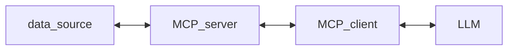

# 🐍 DjangoDay India — Backend Engineering Notes (2025)


### 🧭 TL;DR — Key Takeaways for Backend Engineers

- Optimize ORM joins early (`select_related`/`prefetch_related`).
- Use query profilers regularly on staging data.
- Automate audit integrity checks (hash chaining).
- Plan migrations like releases — never hotfix schema in prod.
- Explore Django’s evolving AI ecosystem (MCP, LLM integrations).
- Contribute small; contribute often.

---

📅 **Conference Schedule:** [https://djangoday.in/schedule](https://djangoday.in/schedule)

---

## 🤝 Team Contribution

- Contribute where possible — even small PRs, doc updates, or issue triage help.
    
- Don’t wait for “free time”; consistency matters more than size of contribution.
    

---

## ⚙️ ORM Query Optimization — _Mahesh Varma_

### 🧩 N+1 Query Fixes

- Use `select_related()` for **foreign key / one-to-one** relationships.
    
- Use `prefetch_related()` for **many-to-many / reverse** relationships.
    

Example:


```python
books = Book.objects.select_related('author__publisher__country__region')
```

> **Tip:** `select_related` joins in one query → good for small tables.  
> For large tables → split into 2 queries and combine in code.

---

### 🔍 Debugging ORM Queries

- **Tools:**
    
    - `django-debug-toolbar`
    - `django-silk`
    - `django-extensions`
	- Quick check using code:
    
    ```python
    from django.db import connection
    connection.queries_log.clear()
    print(len(connection.queries))
    ```
    
- Use `EXPLAIN ANALYZE` to inspect query plans and detect slow joins.
    

---

### 📦 Serializer & Pagination Optimizations

- In DRF serializers: avoid nested lookups that trigger N+1.
    
- Pagination options:
    
    - **LimitOffsetPagination** – simple, but slow on large data.
        
    - **CursorPagination** – scalable and consistent.
        
    - **Cached counts** – avoid `COUNT(*)` on huge tables.
        
- Example reference: [Custom Middleware - nightowlideas](https://github.com/Kdheeru12/nightowlideas)
    

---

## 🧠 AI Agents with Django — _Viraj Sharma_

### Model Context Protocol (MCP)

Current Architecture:



- Repos:
    
    - [MCP Servers](https://github.com/modelcontextprotocol/servers)
    - [MCP SDK Docs](https://modelcontextprotocol.io/docs/sdk)
    - [django-mcp-server](https://github.com/gts360/django-mcp-server)
        

### Async Operations

- Use **gevent / greenlet** for async I/O operations.
    - Apply **monkey patching** cautiously.
        

### Dev tool for development

```bash
git devcontainer <name> up --backend main
zeditor <SSH_HOST>
```

---

## 🧾 Immutable Audit Trails — _Himanshu Shankar_

### Audit vs Logs

- **Logs** = operational events
- **Audit trail** = immutable record of user/business actions
    

### Design Principles

- Append-only tables
- Seek pagination (by timestamp or offset)
- Composite indexes for query performance
    

### Data Integrity

- Use **hash chaining** — each row stores hash of previous record.
    
- Add periodic verification script to detect tampering.

Questions:
- audit systems  in **distributed environments** 
    

---

## 🧱 Django at Scale — _HappyFox Case Study_

### Scaling Strategy

- **Start** with vertical scaling → move to **horizontal scaling** at scale.
    
- Split read/write loads across DB replicas.
    

### Multi-Tenancy Approaches

1. **Tenant ID in all tables** (Django supported)
2. **Dedicated schema per tenant But Shard database** 
    
3. **Dedicated DB per tenant** (strongest isolation, more overhead)
    

### Background Jobs

- Avoid large customers blocking small ones.
- Options:
    - Per-tenant queue (DB overhead ↑)
    - **Database as queue** (query for urgent jobs dynamically)
        

---

## ♿ Accessibility — _Saptak S_

- Accessibility is a must for all Django community tools and web apps.

---

## 🧩 Safe Migrations & DB Maintenance

### Common Pitfalls & Fixes

|Operation|Risk|Best Practice|
|---|---|---|
|`AlterField(null=False)`|Full table rewrite|Run during low traffic|
|`AddIndex(fields=["email"])`|Lock risk|Use **concurrent index** in PostgreSQL|
|`CharField → DateTimeField`|Rewrite table|Add new column → backfill → swap|
|`RemoveField("legacy_code")`|App crash|Deprecate in code first|
|Large `update()`|DB overload|Use batch updates|
|Add FK constraint|Validates all rows|Split into: backfill → constraint add|

---

## 🤖 Django’s Unfair AI Advantage

- Django offers a strong base for AI-enabled dev workflows.
    
- Encourages **AI-assisted coding**, **LLM integrations**, and **agent orchestration**.
    
- Reference: [Django’s Unfair AI Advantage (Google Doc)](https://docs.google.com/document/d/1272DC9t77e3jzI5nQN1yliIJtGabiElFl6BK3j_jPWA/edit?tab=t.0)
    

    
